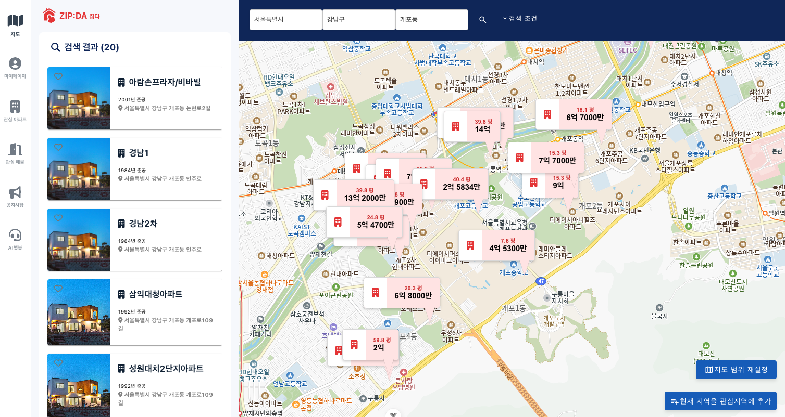
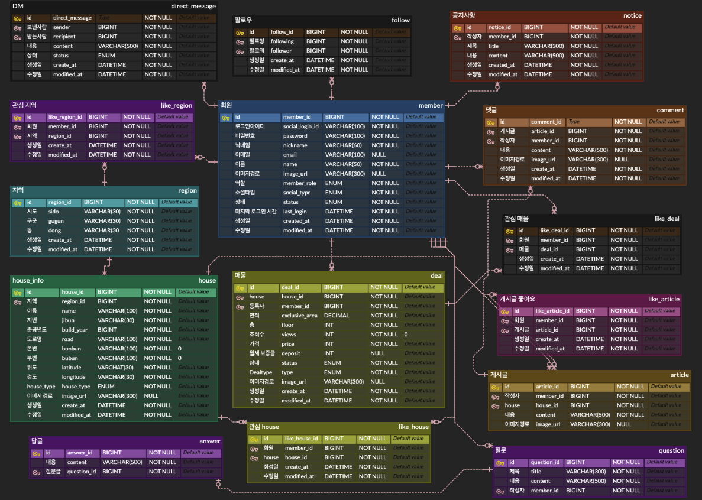

  

'집다'는 부동산 매물 검색 및 커뮤니티 플랫폼 입니다.

## 프로젝트 소개

- SSAFY 관통 프로젝트로 부동산 매물 데이터를 제공 받아, 개발한 프로젝트 입니다.

---

## 화면

#### 메인

#### 로그인

#### 쪽지

#### 검색

#### 공지사항

#### 챗봇

#### 관심 지역

#### 관심 아파트

#### 회원 정보 수정

---

## ERD

---

## 기술 스택

#### Back-End

<table border="0" style="border-collapse: collapse;">
  <tr>
    <td align="center" width="110" style="border: none;">
       
      <b>Java 21</b>
    </td>
    <td align="center" width="110" style="border: none;">
       
      <b>Spring Boot 3.3.5</b>
    </td>
    <td align="center" width="110" style="border: none;">
       
      <b>Spring Data JPA</b>
    </td>
    <td align="center" width="110" style="border: none;">
       
      <b>QueryDSL</b>
    </td>
    <td align="center" width="110" style="border: none;">
       
      <b>Swagger</b>
    </td>
  </tr>
</table>

#### Front-End

<table border="0" style="border-collapse: collapse;">
  <tr>
    <td align="center" width="110" style="border: none;">
       
      <b>Vue.js 3.5.12</b>
    </td>
    <td align="center" width="110" style="border: none;">
       
      <b>CSS</b>
    </td>
    <td align="center" width="110" style="border: none;">
       
      <b>HTML5</b>
    </td>
    <td align="center" width="110" style="border: none;">
       
      <b>JavaScript</b>
    </td>
    <td align="center" width="110" style="border: none;"></td>
    <td align="center" width="110" style="border: none;"></td>
  </tr>
</table>

#### Database / Cache

<table border="0" style="border-collapse: collapse;">
  <tr>
    <td align="center" width="110" style="border: none;">
       
      <b>Redis</b>
    </td>
    <td align="center" width="110" style="border: none;">
       
      <b>MySQL</b>
    </td>
    <td align="center" width="110" style="border: none;"></td>
    <td align="center" width="110" style="border: none;"></td>
  </tr>
</table>

---

## 주요 개발 기능 (담당)

### Spring Boot 기반 단일 서비스: 기술 스택 정리

아래는 현재 프로젝트에서 사용한 주요 **Spring Boot** 및 관련 기술들에 대한 정리입니다. 실제 구현된 기능들을 기반으로 작성되었습니다.

#### 1. Spring Data JPA & QueryDSL

- **개념**: 데이터베이스 접근 계층을 위한 JPA 구현체와 타입 안전한 쿼리 빌더
- **특징 및 적용 방식**
  - **JPA Repository**: 기본 CRUD 작업을 위한 표준 인터페이스 활용
  - **QueryDSL**: 복잡한 조건 검색과 동적 쿼리 구성
    - 예: `DealQueryRepository`, `HouseQueryRepository` 등에서 다양한 검색 조건 처리
  - **MySQL 연동**: 프로덕션 환경에서 MySQL 8.0 사용

---

#### 2. Spring AOP & JWT

- **개념**: AOP를 활용한 인증(Authentication)과 인가(Authorization) 처리
- **특징 및 적용 방식**
  - **JWT 토큰 기반 인증**: `JwtProvider` 클래스를 통한 토큰 생성 및 검증
    - Access Token과 Refresh Token 분리 관리
    - 설정 파일에서 비밀키와 만료시간 외부화 (`@Value` 활용)
  - **AOP 기반 권한 관리**: `@UserAccess`, `@AdminAccess` 등 커스텀 어노테이션과 Aspect를 통한 권한 체크
    - `UserAccessAspect`, `AdminAccessAspect` 등으로 메소드 실행 전 권한 검증
  - **직접 구현한 소셜 로그인**: Google, Kakao, Naver OAuth Provider 직접 구현

---

#### 4. Redis

- **개념**: 인메모리 데이터 저장소를 활용한 캐싱 및 세션 관리
- **특징 및 적용 방식**
  - **Refresh Token 저장**: 토큰 관리를 위한 캐시 저장소
  - **고성능 조회**: 빈번한 조회 작업의 성능 향상
  - **설정 외부화**: `application.yml`에서 Redis 호스트/포트 관리

---

#### 5. Spring AI & OpenAI

- **개념**: AI 기능 통합을 위한 Spring AI 프레임워크
- **특징 및 적용 방식**
  - **OpenAI API 연동**: ChatGPT 모델을 활용한 챗봇 서비스
  - **프롬프트 템플릿**: `prompts/` 디렉토리의 `.st` 파일로 다양한 시나리오별 프롬프트 관리
  - **AI Controller**: 부동산 관련 상담 및 정보 제공 서비스

---

#### 6. Swagger/OpenAPI 3

- **개념**: API 문서화 및 테스트를 위한 자동화 도구
- **특징 및 적용 방식**
  - **자동 API 문서 생성**: `@OpenAPIDefinition` 어노테이션으로 API 명세서 구성
  - **Controller Docs**: 각 도메인별 `ControllerDocs` 인터페이스로 API 문서화
  - **실시간 테스트**: Swagger UI를 통한 API 테스트 환경 제공

---

#### 7. Spring Mail

- **개념**: 이메일 발송 기능을 위한 Spring 모듈
- **특징 및 적용 방식**
  - **Gmail SMTP 연동**: 이메일 인증 및 알림 기능
  - **비밀번호 재설정**: 인증 코드 발송을 통한 보안 강화
  - **설정 외부화**: `application-secret.yml`로 민감 정보 분리

---

#### 8. 도메인 기반 아키텍처

- **개념**: 도메인별로 패키지를 분리한 클린 아키텍처
- **특징 및 적용 방식**
  - **계층 분리**: `presentation` → `application` → `domain` → `infrastructure`
  - **도메인별 모듈화**: `member`, `house`, `deal`, `article`, `auth` 등
  - **의존성 역전**: Repository 인터페이스를 domain에, 구현체를 infrastructure에 배치

---

## 팀원

|                                           Backend                                           |                                         Frontend                                          |
| :-----------------------------------------------------------------------------------------: | :---------------------------------------------------------------------------------------: |
|  |  |
|                         [유선우](https://github.com/BrokenFinger98)                         |                           [조예슬](https://github.com/seul1230)                           |
